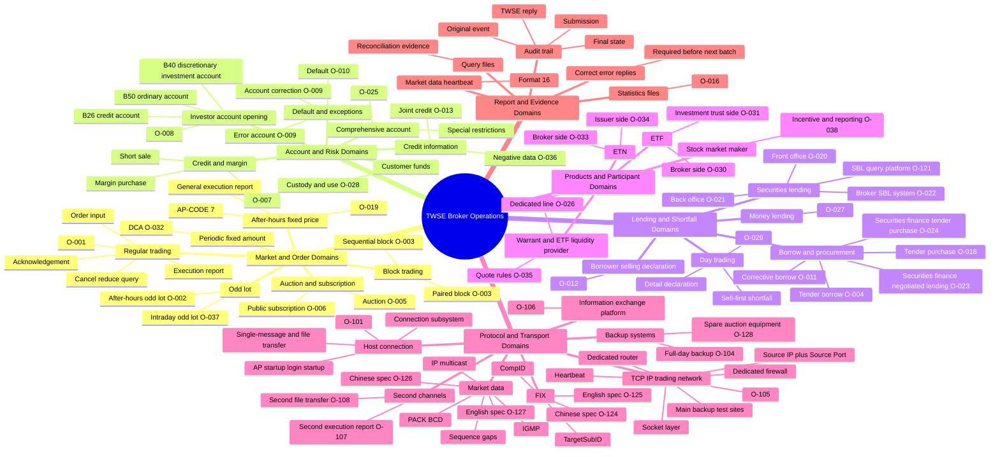
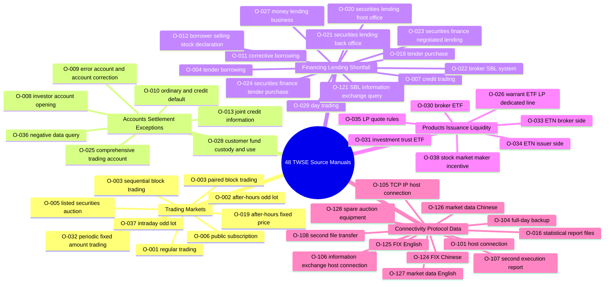

# TWSE Broker Manual Mind Map

Use this file when a user wants the whole skill as a mental map, or when a broad question needs orientation before opening detailed references.

This is a navigation artifact. For exact fields, file layouts, codes, and time windows, route from this map to the relevant reference and then to the extracted source manual.

## Expert Mental Model

## Manual Routing Map

## Ambiguity Map

| User phrase | Route first | Avoid confusing with |
| --- | --- | --- |
| 開戶 | `O-008` investor/account-opening workflows | KYC law, comprehensive account, credit account unless specified |
| 全權委託開戶 | `O-008` B40/B41/BC5 | Ordinary B50 account only |
| 錯帳 | `O-009` B02/B08/B54/B55/B57 | Default, account correction, order modification |
| 更正帳號 | `O-009` but separate from錯帳 | Error account quantity repair |
| 違約 | `O-010` ordinary/credit default | Order reject,錯帳, day-trade shortfall |
| 借券 | First classify lifecycle | SBL, tender borrow, corrective borrow, borrower sell, shortfall repair |
| 標借 | `O-004` tender borrowing | 標購, 證金標購, ordinary SBL |
| 標購 | `O-018` tender purchase | 標借, 證金標購 |
| 證金標購 | `O-024` | Exchange tender purchase |
| 證金議借 | `O-023` | Tender borrow or ordinary SBL |
| 當沖券差 | `O-029` then repair manuals | Ordinary SBL only |
| 行情 | `O-126/O-127` | Host TCP socket or FIX |
| 下單 FIX | `O-124/O-125` plus market manual | Market-data feed |
| Source IP Port socket | `O-105` | FIX CompID or multicast group |
| 第二路 | Need object: execution report or file transfer | Market-data duplicate multicast groups |
| 備援 | Need object: line/site/full-day/spare equipment | Active-active business semantics |

## How To Use This Map

1. Start with the user phrase and choose a domain.
2. If the phrase is ambiguous, use the ambiguity map before answering.
3. Open the domain reference:
   - Trading: `trading-markets.md`
   - Accounts/exceptions: `accounts-settlement-and-exceptions.md`
   - Financing/lending/shortfall: `financing-lending-and-shortfall.md`
   - Products/liquidity: `products-liquidity-and-issuance.md`
   - Connectivity/protocol: `broker-exchange-integration.md`, then `protocols-and-market-data.md`
4. For exact fields or file formats, open the extracted source text listed in `manual-index.md`.
5. Cite the manual title and update date in the answer.

